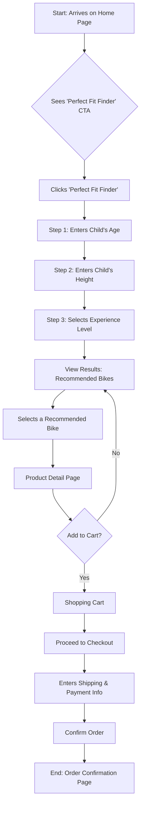
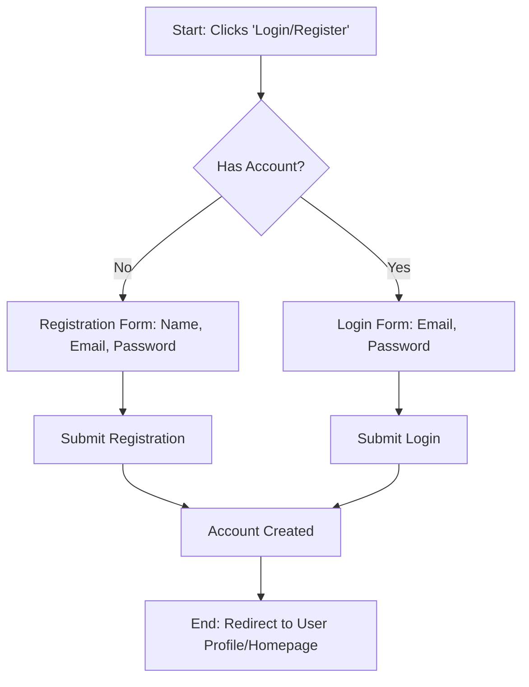

# UI/UX Specification: Top xe đạp E-commerce Platform

- **Version:** 1.0
- **Date:** July 10, 2025
- **Author:** Jane, Design Architect
- **Project:** "Top xe đạp" Children's Bicycle E-commerce Platform

## 1\. Overview

This document outlines the User Interface (UI) and User Experience (UX) strategy for the "Top xe đạp" e-commerce platform. The primary goal is to create a trusted, parent-friendly online destination that transforms the often confusing process of buying a child's bicycle into a simple, confident, and joyful experience. This specification will guide the visual design, user flows, and frontend development of the Minimum Viable Product (MVP).

## 2\. Design Philosophy & Principles

The design of "Top xe đạp" will be guided by three core principles:

- **Playful Confidence:** The visual identity will be clean, modern, and professional to build trust with parents, while incorporating playful elements (illustrations, colors, typography) that resonate with the joy of childhood. It should feel like a premium, expert-led children's brand.
- **Clarity Above All:** The user's journey will be effortless. Navigation will be intuitive, language will be simple and direct, and layouts will be uncluttered. Every element on the screen must serve a clear purpose to reduce cognitive load on busy parents.
- **Guided Journey:** We will proactively guide users toward the best decision for their child. The platform's standout feature, the "Perfect Fit Finder," will be the centerpiece of this philosophy, anticipating user needs and answering their most critical questions before they even have to ask.

## 3\. Branding & Visual Identity (Initial Proposal)

- **Project Name:** Top xe đạp
- **Logo Concept:** A modern, friendly wordmark for "Top xe đạp" paired with a simple, stylized icon. The icon could be a bicycle wheel with a star in the center or a shield icon to subtly represent safety and trust.
- **Color Palette:**
  - **Primary:** `#00A8E8` (A bright, energetic, and trustworthy blue).
  - **Secondary:** `#F7B801` (A warm, friendly, and optimistic yellow-orange for accents and calls-to-action).
  - **Neutrals:** `#212529` (Near-black for primary text), `#6C757D` (Grey for secondary text), `#F8F9FA` (Off-white for backgrounds).
  - **System/Accent:** `#28A745` (Success/Green), `#DC3545` (Error/Red).
- **Typography:**
  - **Headings:** `Baloo 2` - A friendly, rounded sans-serif that is playful yet highly legible.
  - **Body Text:** `Inter` - A clean, modern, and extremely readable sans-serif perfect for UI text, product descriptions, and articles.

## 4\. User Personas & Scenarios

- **Primary Persona: "Phuong, the Cautious Parent"**
  - **Demographics:** 35 years old, parent of a 6-year-old son. Lives in a city.
  - **Goals:** Buy a safe, high-quality bike that is the perfect size for her son. Wants the bike to last but knows he will outgrow it. Wants to feel confident in her online purchase.
  - **Frustrations:** Overwhelmed by technical jargon (wheel sizes, frame types). Worries about online scams. Finds it difficult to judge size and quality from photos alone.
- **User Scenario (MVP):** Phuong's friend recommends the "Top xe đạp" website. She visits the homepage and is immediately drawn to the "Find the Perfect Fit" quiz. She answers simple questions about her son's age and height. The site recommends two bikes. She clicks one, reads the clear specifications, sees a 360-degree view, and notes the recommended safety helmet bundle. Feeling confident, she adds the bike and helmet to her cart and completes the purchase.

## 5\. User Flows

### 5.1 New User 'Perfect Fit' Purchase Journey

### 5.2 User Registration & Login Flow

## 6\. Wireframes & Key Screen Descriptions (MVP)

- **Home Page:**
  - **Layout:** Clean, image-forward design.
  - **Components:**
    - Full-width hero banner with a compelling image and a prominent Call-to-Action (CTA) for the "Perfect Fit Finder".
    - Trust-building section below the hero: "Expert Advice," "Safety Certified," "Free Shipping."
    - Grid of featured product categories (e.g., "Bikes for Ages 3-5," "First Pedal Bikes").
    - Simple, clean header with Logo, Navigation (Bikes, Safety Gear, Guides), and Cart/Login icons.
    - Footer with contact info, policies, and social media links.
- **'Perfect Fit' Finder Screen:**
  - **Layout:** A full-screen modal or dedicated page with a multi-step process.
  - **Components:**
    - Large, friendly headings for each step (e.g., "How old is the rider?").
    - Simple input fields and selectors with playful illustrations.
    - Progress bar to show the user where they are in the process.
    - Results page displays 1-3 recommended products with a primary "Best Match" highlighted.
- **Product Detail Page (PDP):**
  - **Layout:** Two-column layout on desktop.
  - **Components:**
    - Left Column: Product image gallery with high-resolution photos, 360-degree view, and video.
    - Right Column: Product Name, Price, "Perfect Fit" badge (if applicable), short description, key specs (age, height range, weight), color swatches, "Add to Cart" CTA.
    - Below columns: Tabbed section for "Full Description," "Technical Specs," and "Reviews."
    - Cross-sell module: "Complete the Set" featuring matching helmets and pads.
- **Admin Portal (Conceptual):**
  - **Layout:** Standard dashboard UI.
  - **Components:**
    - Persistent left-hand navigation menu (Dashboard, Orders, Products, Customers, Content, Settings).
    - Main content area displays data tables and forms for managing the selected section.
    - Dashboard homepage shows key metrics at a glance: recent orders, low-stock alerts, sales charts.

## 7\. Accessibility (A11y)

The platform will be developed to meet **WCAG 2.1 Level AA** compliance as a minimum standard. Key considerations include:

- **Semantic HTML:** Using correct HTML5 tags (`<nav>`, `<main>`, `<header>`, etc.) to ensure a logical document structure.
- **Keyboard Navigation:** All interactive elements must be fully accessible and operable via keyboard alone.
- **Color Contrast:** All text and UI elements will meet minimum contrast ratios.
- **Alt Text:** All meaningful images will have descriptive alt text.

## 8\. Handoff & Next Steps

This UI/UX Specification is now ready for review and refinement. It will serve as the primary source of truth for:

- **The Architect (Fred):** To begin creating the detailed **Frontend Architecture Document**.
- **The Product Manager (John):** To write detailed User Stories for each feature within the PRD Epics.
- **The Development Team:** To understand the intended user experience and visual design.
