# Sequence Diagrams

## Core Workflow / Sequence Diagrams

### User Registration Flow

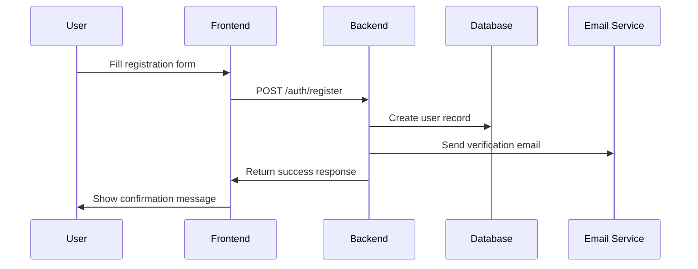
```mermaid
sequenceDiagram
    participant U as User
    participant F as Frontend
    participant B as Backend
    participant DB as Database
    participant E as Email Service

    U->>F: Fill registration form
    F->>B: POST /auth/register
    B->>DB: Create user record
    B->>E: Send verification email
    B->>F: Return success response
    F->>U: Show confirmation message
```

### Product Purchase Flow

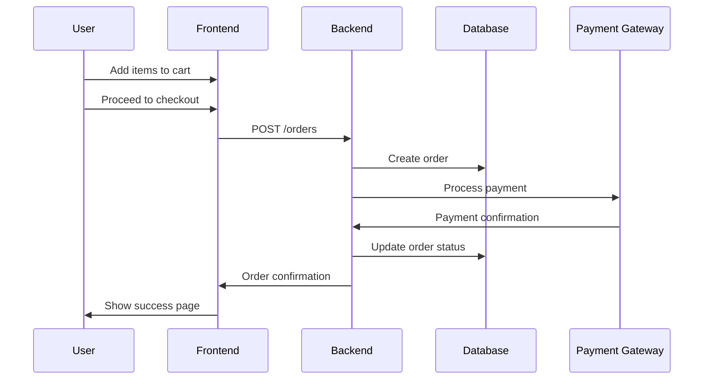
```mermaid
sequenceDiagram
    participant U as User
    participant F as Frontend
    participant B as Backend
    participant DB as Database
    participant P as Payment Gateway

    U->>F: Add items to cart
    U->>F: Proceed to checkout
    F->>B: POST /orders
    B->>DB: Create order
    B->>P: Process payment
    P->>B: Payment confirmation
    B->>DB: Update order status
    B->>F: Order confirmation
    F->>U: Show success page
```

## Authentication Flow

### User Login Process

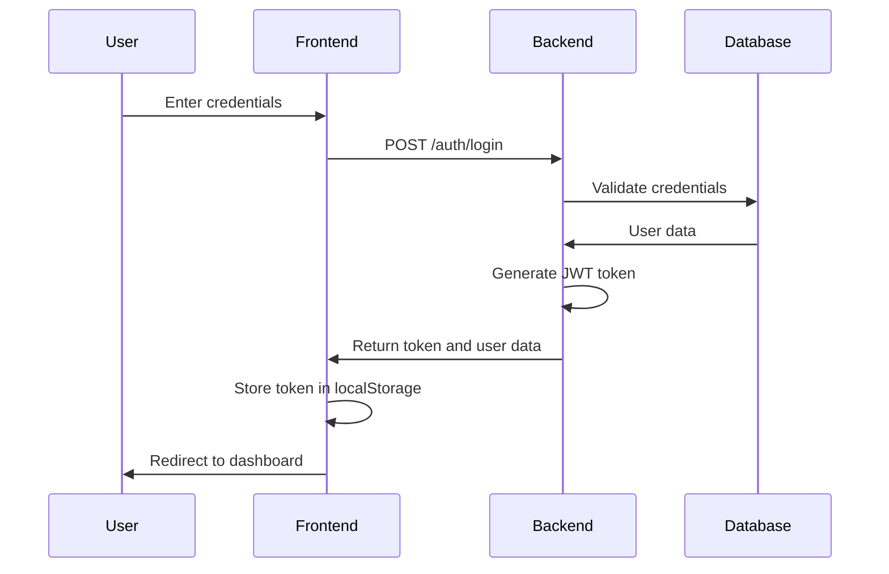
```mermaid
sequenceDiagram
    participant U as User
    participant F as Frontend
    participant B as Backend
    participant DB as Database

    U->>F: Enter credentials
    F->>B: POST /auth/login
    B->>DB: Validate credentials
    DB->>B: User data
    B->>B: Generate JWT token
    B->>F: Return token and user data
    F->>F: Store token in localStorage
    F->>U: Redirect to dashboard
```

### Token Refresh Flow

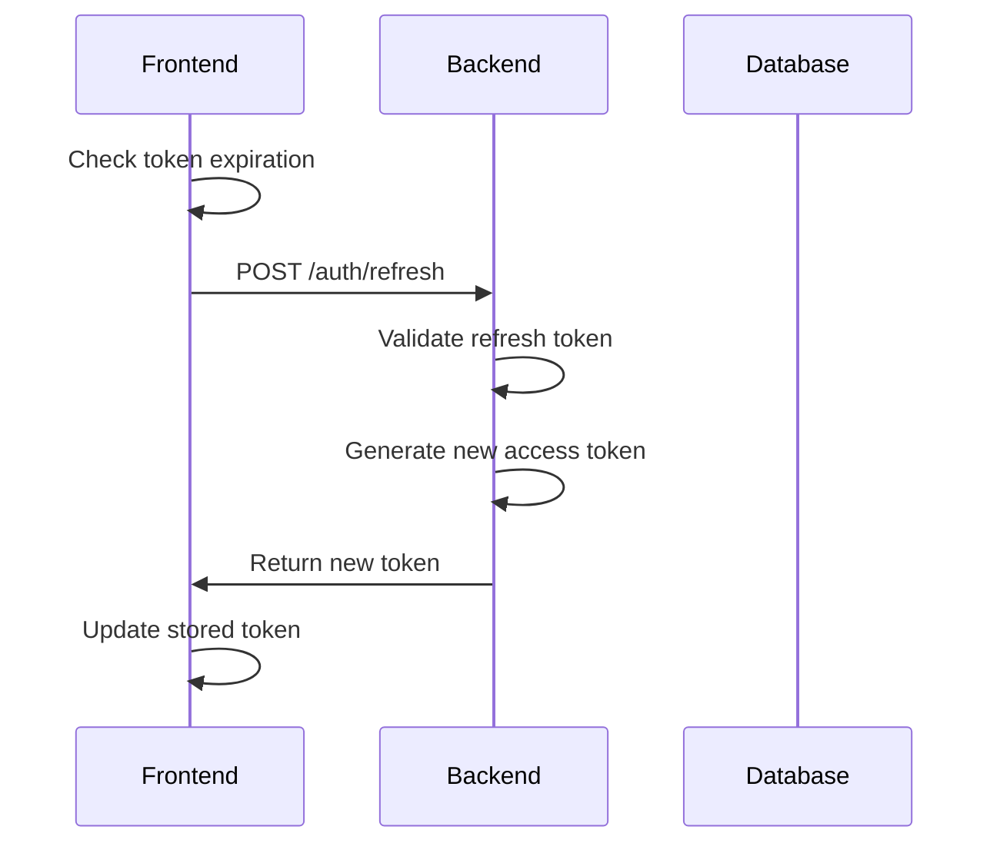
```mermaid
sequenceDiagram
    participant F as Frontend
    participant B as Backend
    participant DB as Database

    F->>F: Check token expiration
    F->>B: POST /auth/refresh
    B->>B: Validate refresh token
    B->>B: Generate new access token
    B->>F: Return new token
    F->>F: Update stored token
```

## Product Management Flow

### Product Search and Filtering

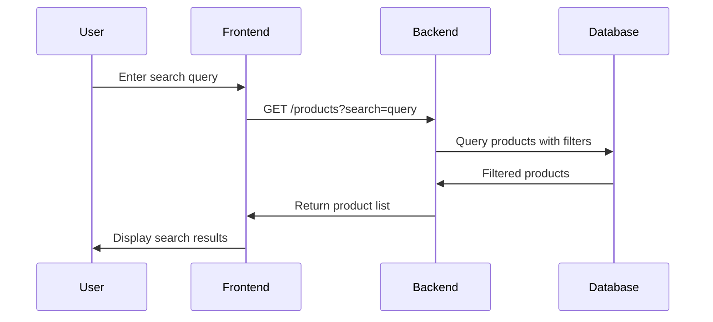
```mermaid
sequenceDiagram
    participant U as User
    participant F as Frontend
    participant B as Backend
    participant DB as Database

    U->>F: Enter search query
    F->>B: GET /products?search=query
    B->>DB: Query products with filters
    DB->>B: Filtered products
    B->>F: Return product list
    F->>U: Display search results
```

### Product Detail View

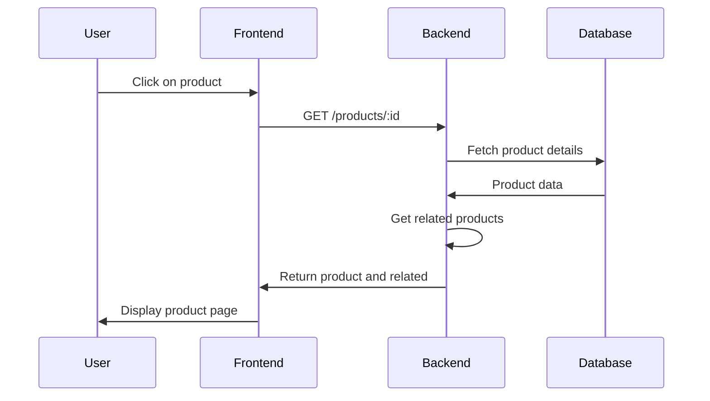
```mermaid
sequenceDiagram
    participant U as User
    participant F as Frontend
    participant B as Backend
    participant DB as Database

    U->>F: Click on product
    F->>B: GET /products/:id
    B->>DB: Fetch product details
    DB->>B: Product data
    B->>B: Get related products
    B->>F: Return product and related
    F->>U: Display product page
```

## Shopping Cart Flow

### Add to Cart Process

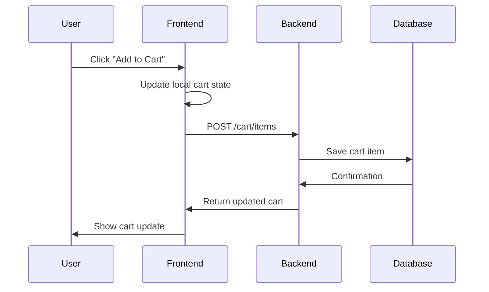
```mermaid
sequenceDiagram
    participant U as User
    participant F as Frontend
    participant B as Backend
    participant DB as Database

    U->>F: Click "Add to Cart"
    F->>F: Update local cart state
    F->>B: POST /cart/items
    B->>DB: Save cart item
    DB->>B: Confirmation
    B->>F: Return updated cart
    F->>U: Show cart update
```

### Cart Synchronization

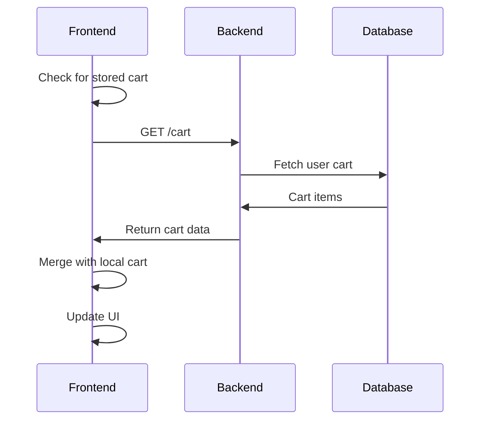
```mermaid
sequenceDiagram
    participant F as Frontend
    participant B as Backend
    participant DB as Database

    F->>F: Check for stored cart
    F->>B: GET /cart
    B->>DB: Fetch user cart
    DB->>B: Cart items
    B->>F: Return cart data
    F->>F: Merge with local cart
    F->>F: Update UI
```

## Order Processing Flow

### Order Creation

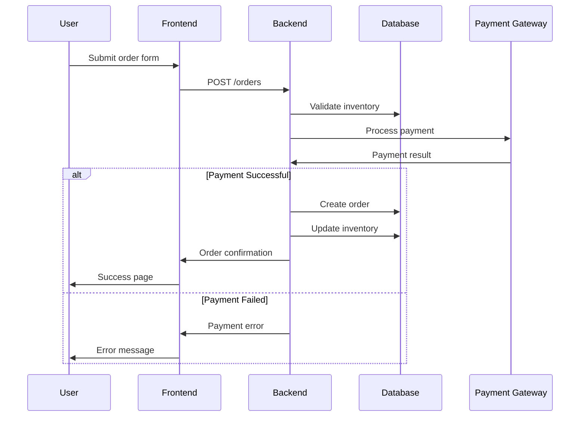
```mermaid
sequenceDiagram
    participant U as User
    participant F as Frontend
    participant B as Backend
    participant DB as Database
    participant P as Payment Gateway

    U->>F: Submit order form
    F->>B: POST /orders
    B->>DB: Validate inventory
    B->>P: Process payment
    P->>B: Payment result
    alt Payment Successful
        B->>DB: Create order
        B->>DB: Update inventory
        B->>F: Order confirmation
        F->>U: Success page
    else Payment Failed
        B->>F: Payment error
        F->>U: Error message
    end
```

### Order Status Updates

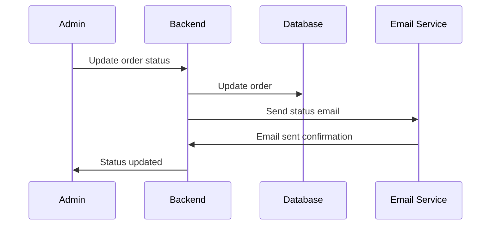
```mermaid
sequenceDiagram
    participant A as Admin
    participant B as Backend
    participant DB as Database
    participant E as Email Service

    A->>B: Update order status
    B->>DB: Update order
    B->>E: Send status email
    E->>B: Email sent confirmation
    B->>A: Status updated
```

## File Upload Flow

### Image Upload Process

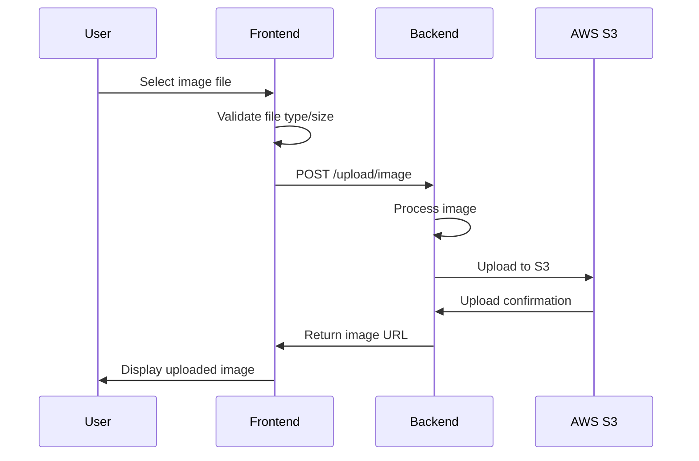
```mermaid
sequenceDiagram
    participant U as User
    participant F as Frontend
    participant B as Backend
    participant S3 as AWS S3

    U->>F: Select image file
    F->>F: Validate file type/size
    F->>B: POST /upload/image
    B->>B: Process image
    B->>S3: Upload to S3
    S3->>B: Upload confirmation
    B->>F: Return image URL
    F->>U: Display uploaded image
```

### File Processing

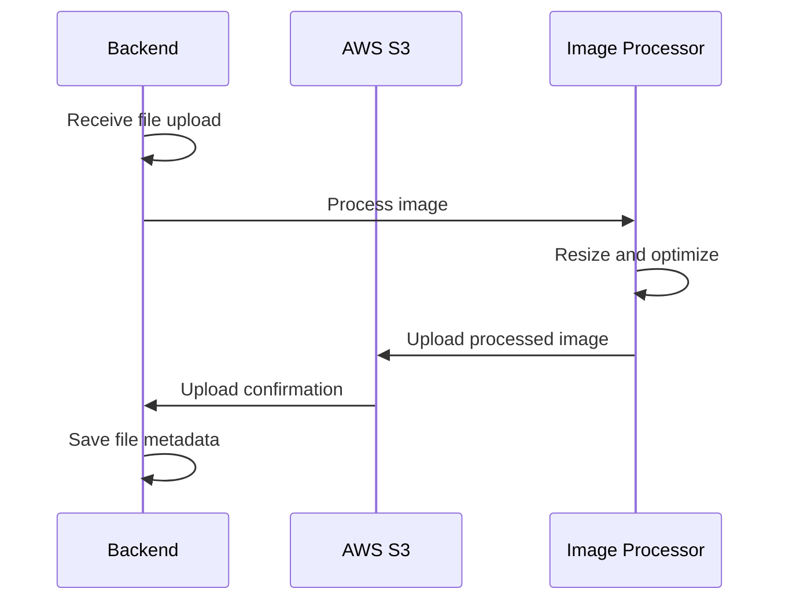
```mermaid
sequenceDiagram
    participant B as Backend
    participant S3 as AWS S3
    participant I as Image Processor

    B->>B: Receive file upload
    B->>I: Process image
    I->>I: Resize and optimize
    I->>S3: Upload processed image
    S3->>B: Upload confirmation
    B->>B: Save file metadata
```

## Email Notification Flow

### Order Confirmation Email

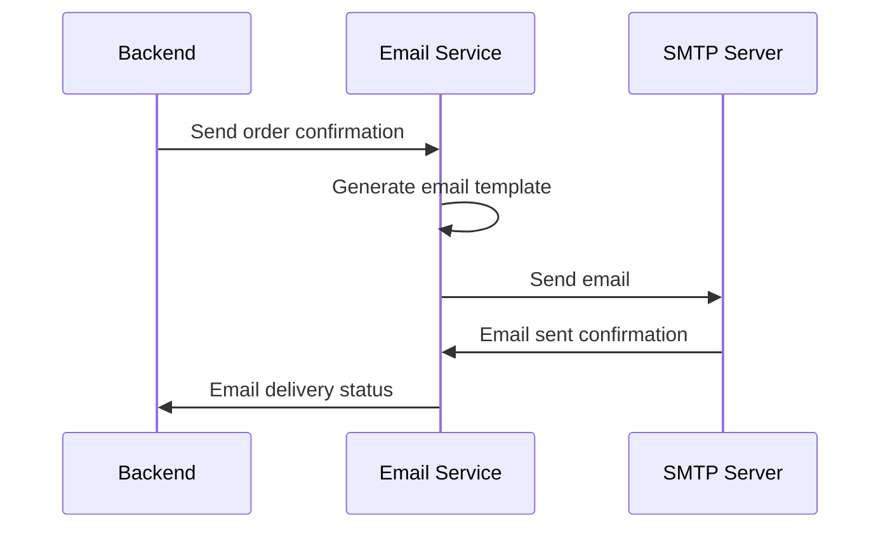
```mermaid
sequenceDiagram
    participant B as Backend
    participant E as Email Service
    participant S as SMTP Server

    B->>E: Send order confirmation
    E->>E: Generate email template
    E->>S: Send email
    S->>E: Email sent confirmation
    E->>B: Email delivery status
```

### Password Reset Flow

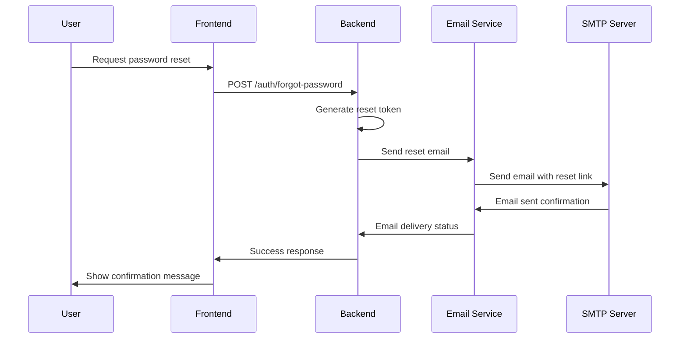
```mermaid
sequenceDiagram
    participant U as User
    participant F as Frontend
    participant B as Backend
    participant E as Email Service
    participant S as SMTP Server

    U->>F: Request password reset
    F->>B: POST /auth/forgot-password
    B->>B: Generate reset token
    B->>E: Send reset email
    E->>S: Send email with reset link
    S->>E: Email sent confirmation
    E->>B: Email delivery status
    B->>F: Success response
    F->>U: Show confirmation message
```

## Error Handling Flow

### API Error Response

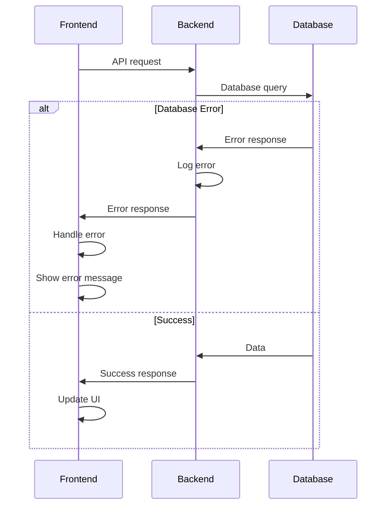
```mermaid
sequenceDiagram
    participant F as Frontend
    participant B as Backend
    participant DB as Database

    F->>B: API request
    B->>DB: Database query
    alt Database Error
        DB->>B: Error response
        B->>B: Log error
        B->>F: Error response
        F->>F: Handle error
        F->>F: Show error message
    else Success
        DB->>B: Data
        B->>F: Success response
        F->>F: Update UI
    end
```

### Network Error Handling

```mermaid
sequenceDiagram
    participant F as Frontend
    participant B as Backend

    F->>B: API request
    alt Network Error
        B--x>F: Connection failed
        F->>F: Retry logic
        F->>B: Retry request
        B->>F: Success response
    else Success
        B->>F: Response
    end
```

## Admin Panel Flow

### Product Management

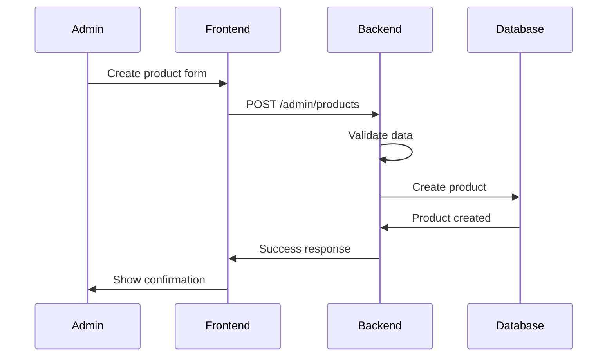
```mermaid
sequenceDiagram
    participant A as Admin
    participant F as Frontend
    participant B as Backend
    participant DB as Database

    A->>F: Create product form
    F->>B: POST /admin/products
    B->>B: Validate data
    B->>DB: Create product
    DB->>B: Product created
    B->>F: Success response
    F->>A: Show confirmation
```

### Order Management

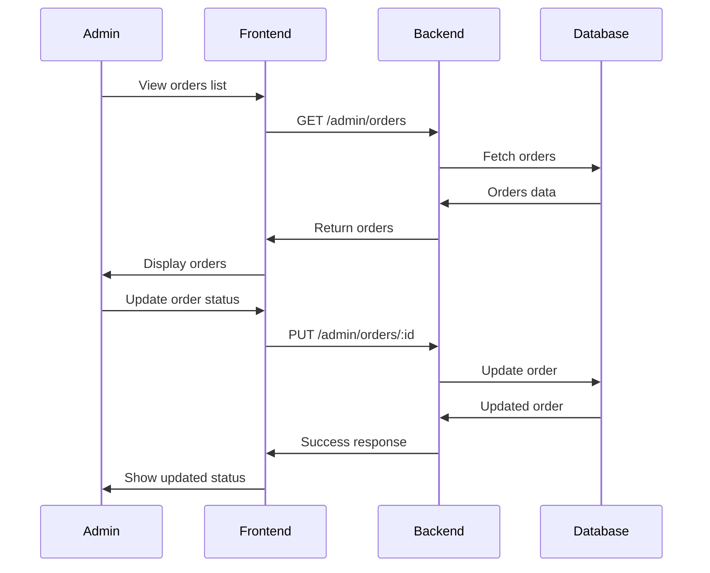
```mermaid
sequenceDiagram
    participant A as Admin
    participant F as Frontend
    participant B as Backend
    participant DB as Database

    A->>F: View orders list
    F->>B: GET /admin/orders
    B->>DB: Fetch orders
    DB->>B: Orders data
    B->>F: Return orders
    F->>A: Display orders

    A->>F: Update order status
    F->>B: PUT /admin/orders/:id
    B->>DB: Update order
    DB->>B: Updated order
    B->>F: Success response
    F->>A: Show updated status
```

## Performance Monitoring Flow

### Health Check Process

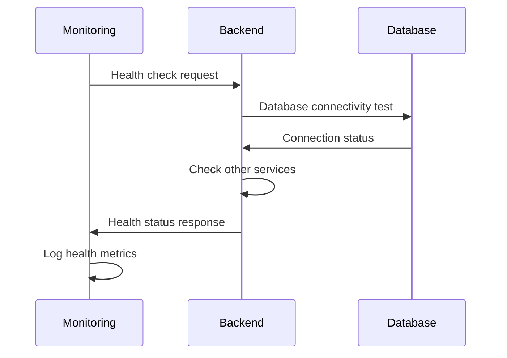
```mermaid
sequenceDiagram
    participant M as Monitoring
    participant B as Backend
    participant DB as Database

    M->>B: Health check request
    B->>DB: Database connectivity test
    DB->>B: Connection status
    B->>B: Check other services
    B->>M: Health status response
    M->>M: Log health metrics
```

### Performance Metrics Collection

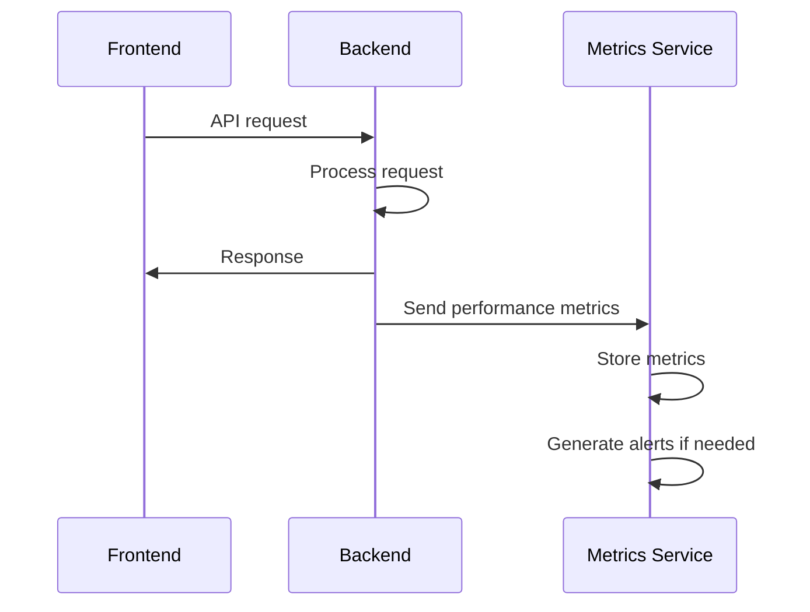
```mermaid
sequenceDiagram
    participant F as Frontend
    participant B as Backend
    participant M as Metrics Service

    F->>B: API request
    B->>B: Process request
    B->>F: Response
    B->>M: Send performance metrics
    M->>M: Store metrics
    M->>M: Generate alerts if needed
```
